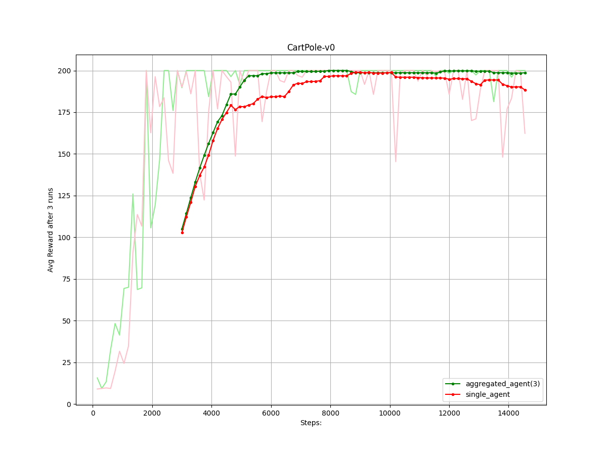
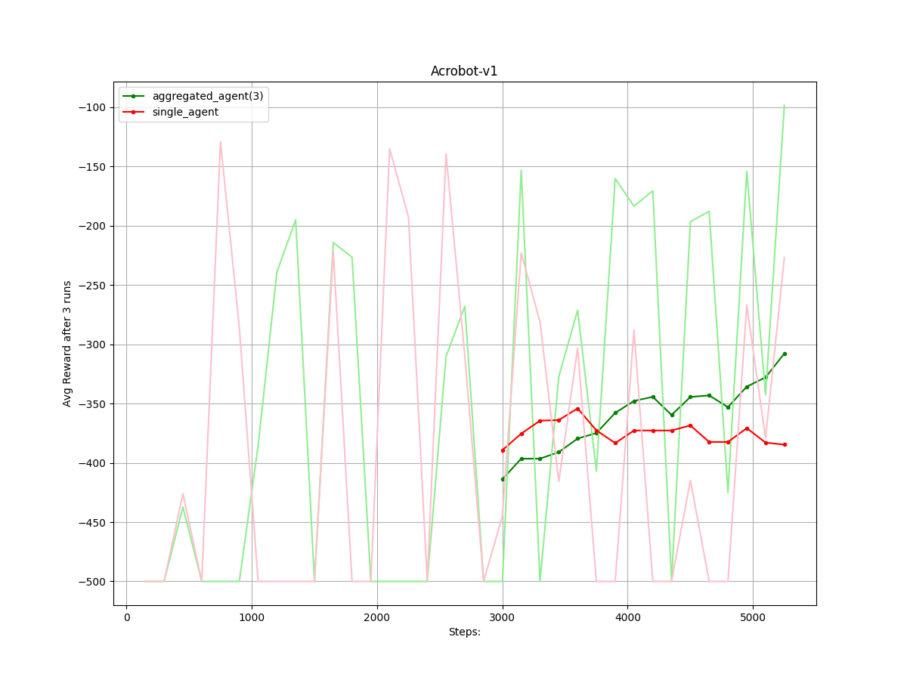
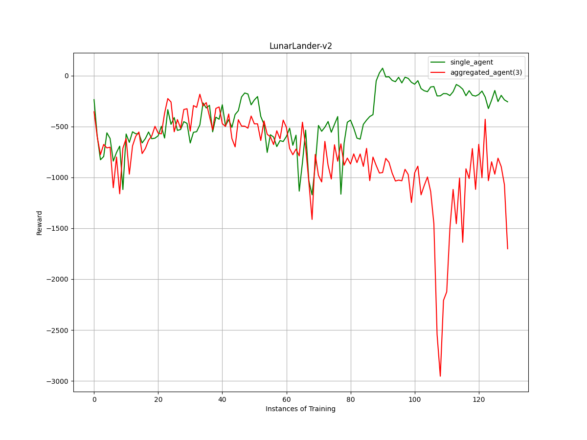

# Federated Model Averaging for Deep Q Networks(FMA-DQN)

This code is an implementation of the paper: [link](https://drive.google.com/file/d/1SWuLjwYBPQK6pSuEtjSCgo2plYMscRpX/view?usp=sharing)

The advent of reinforcement learning greatly pushed the boundaries of computation, ranging from superhuman performance in video games to previously unseen feet in robotics. One of the key limitations that prevent the deployment of Deep RL based solutions in real-world applications is the need for a reliable data generating environment. The convergence of the algorithms rely on rigorous data collection and also prove to be sample inefficient. However, it is impossible to collect such magnitudes of data from a real system and the usage of simulation leads to domain variations and inaccurate modelling. Federated Learning provides an alternative solution, to deploy distributed learning in a real-world system, ensuring the privacy of the data and also sharing the computation load across multiple workers. This solves the problem of using a single system to collect impractical amounts of data and enables us to obtain samples directly from the deployment domain. In this work, we propose a novel formulation titled Federated Deep Q Networks (F-DQN) to perform distributed learning for Deep RL algorithms.

## Requirements:
* PyTorch
* numpy
* matplotlib
* pandas
* gym

## Running the code:
Use:

`python3 multiple_trainer.py`

The plots are saved in the plots/ folder.

## Results:

* For CartPole environment:

 

* For Acrobot environment:

 

* For LunarLander environment:

 

